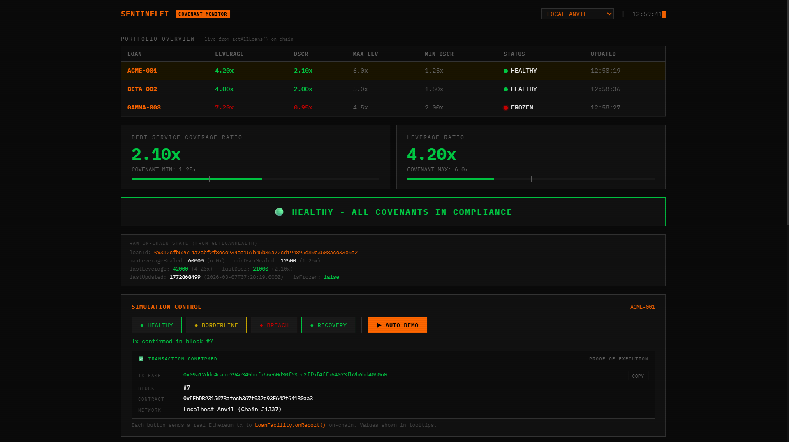
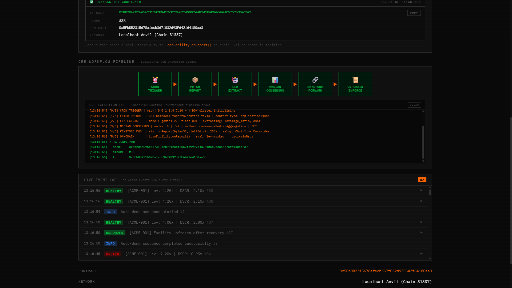
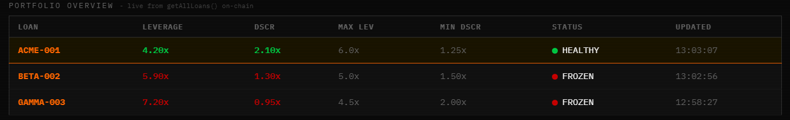
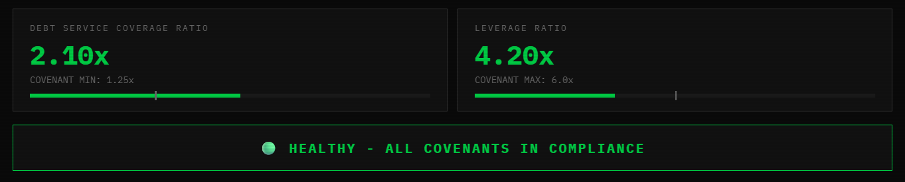
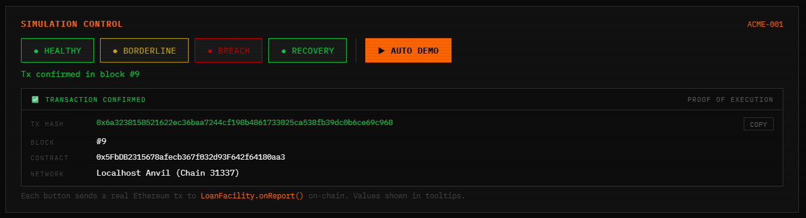
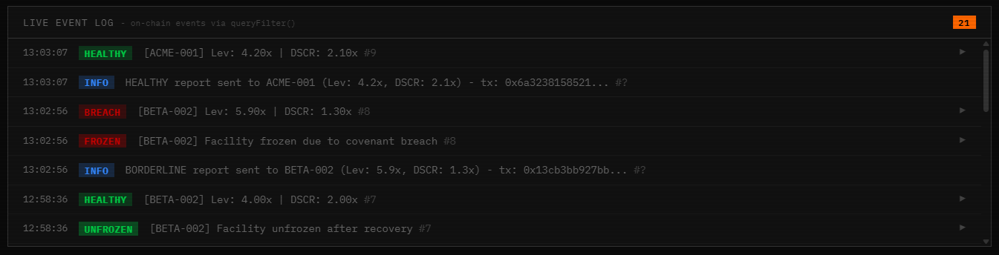
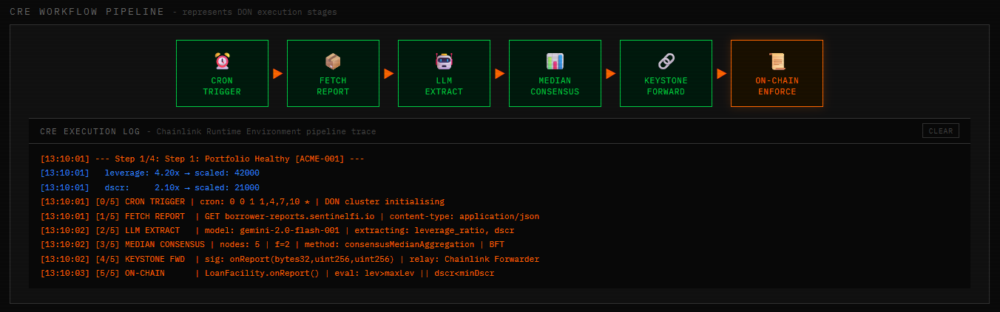
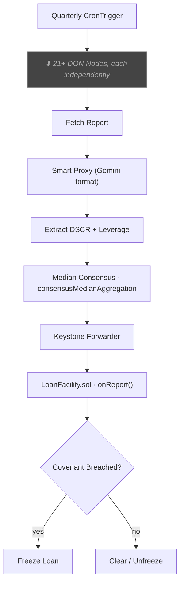

# SentinelFi

**Autonomous covenant monitoring for private credit, powered by Chainlink CRE.**

Quarterly financial reports come in → DON nodes independently extract leverage and DSCR → median consensus across 21+ nodes → auto-freeze or clear on-chain. No human in the loop.

[](contracts/src/LoanFacility.sol)
[](contracts/test/LoanFacility.t.sol)

---

## What's the Problem?

Private credit is a $1.7 trillion market. Lenders set rules on every loan - "leverage can't exceed 6x", "DSCR must stay above 1.25x." Every quarter, someone has to check these.

Today that's a human reading a PDF, pulling numbers into a spreadsheet, comparing against thresholds, and making phone calls if something's off. This is slow (report lands Friday, gets read Monday), error-prone (one analyst, no verification), and reactive (borrower can default before anyone picks up the phone).

SentinelFi replaces the entire process. From report ingestion to on-chain enforcement, it's fully autonomous.

---

## Dashboard



The dashboard is a single-page Bloomberg-terminal-style interface. Everything displayed comes directly from on-chain reads - `getAllLoans()` for the portfolio, `queryFilter()` for the event history. Nothing is hardcoded.



### Portfolio Table

Every loan in the contract shows up here with its current leverage, DSCR, covenant limits, frozen status, and last update time. Click any row to drill into that loan's details.



### Metric Cards & Threshold Bars

When you select a loan, the detail panel shows live DSCR and leverage values with visual threshold bars. The bars show exactly where the current value sits relative to its covenant limit.



### Simulation Panel

Send real Ethereum transactions with one click. Each button encodes a specific leverage/DSCR scenario, calls `onReport()` on-chain, and the contract evaluates it against that loan's thresholds. The same values hit different loans differently - 5.90x leverage is fine for ACME (max 6.0x) but a breach for BETA (max 5.0x).



### Event Log

Every `CovenantBreached`, `CovenantHealthy`, `LoanFrozen`, and `LoanUnfrozen` event from the contract shows up here with its block timestamp. This is from `queryFilter()` - real on-chain events.



### CRE Pipeline Visualization

An animated 6-stage diagram that mirrors the actual CRE workflow: Cron Trigger → Fetch Report → LLM Extract → Median Consensus → ABI Encode → On-Chain Write. It lights up stage-by-stage during Auto Demo.



---

## Architecture



Each DON node calls the proxy independently and extracts its own values. `consensusMedianAggregation` takes the median - so even if some nodes return garbage, the result is correct. One trusted server becomes 21+ independent verifiers.

> **Simulation proxy vs production:** The proxy speaks the exact Gemini API format but uses regex extraction instead of LLM inference. The workflow code (`workflow.ts`) is production-ready for real Gemini - you'd only change the `geminiApiUrl` config value. We use the proxy for reliable hackathon demo execution.

---

## How CRE Makes This Work

| CRE Capability               | Where                                                        | What It Does                                            |
| ---------------------------- | ------------------------------------------------------------ | ------------------------------------------------------- |
| `CronTrigger`                | [`workflow.ts` L258-L261](cre-workflow/src/workflow.ts)      | Fires quarterly, no human trigger needed                |
| `HTTPClient` (Node Mode)     | [`workflow.ts` L85-L120](cre-workflow/src/workflow.ts)       | Each node independently calls the simulation proxy      |
| `consensusMedianAggregation` | [`workflow.ts` L207](cre-workflow/src/workflow.ts)           | BFT median across all node results per loan             |
| `EVMClient.writeReport`      | [`workflow.ts` L228-L240](cre-workflow/src/workflow.ts)      | Writes consensus result to chain via Keystone Forwarder |
| `onlyForwarder` modifier     | [`LoanFacility.sol` L43-L49](contracts/src/LoanFacility.sol) | Contract rejects any caller that isn't the Forwarder    |

Without CRE: one server extracts metrics, you trust that server.
With CRE: 21+ nodes each extract independently, median consensus filters out bad actors.

---

## Repo Structure

```
sentinelfi/
├── contracts/
│   ├── src/LoanFacility.sol           ← on-chain covenant enforcer (onReport, onlyForwarder)
│   ├── script/DeployLoanFacility.s.sol ← deploys contract + registers 3 loans
│   └── test/LoanFacility.t.sol        ← 29 Foundry tests
├── cre-workflow/
│   ├── workflow.yaml                  ← CRE CLI target config (artifact paths, secrets)
│   ├── src/workflow.ts                ← full CRE workflow (HTTPClient, consensus, EVMClient)
│   ├── config.staging.json            ← network + contract addresses
│   └── package.json
├── mock-api/
│   ├── server.js                      ← Express backend (simulation + report serving)
│   ├── api/report.ts                  ← financial report endpoint
│   └── api/gemini-proxy.ts            ← Gemini-format simulation proxy
├── frontend/
│   └── index.html                     ← Bloomberg-style monitoring dashboard
├── secrets.yaml                       ← CRE secrets manifest (maps to .env)
└── .env.example
```

**Chainlink integration sits in 3 files:**

1. **[`cre-workflow/src/workflow.ts`](cre-workflow/src/workflow.ts)** - the full CRE workflow. HTTPClient for per-node API calls, consensusMedianAggregation for BFT, EVMClient for on-chain writes.
2. **[`cre-workflow/workflow.yaml`](cre-workflow/workflow.yaml)** - CRE CLI target config, artifact paths, secrets mapping. The `CronTrigger` and all capabilities are declared in `workflow.ts`.
3. **[`contracts/src/LoanFacility.sol`](contracts/src/LoanFacility.sol)** - `onReport()` entry point with `onlyForwarder` modifier. Only the Keystone Forwarder can deliver reports.

---

## Demo Scenarios

The simulation panel sends real Ethereum transactions. Each button ABI-encodes `(bytes32 loanId, uint256 leverage, uint256 dscr)` and calls the contract's `onReport()`. The contract checks the values against that loan's specific thresholds:

| Scenario   | Leverage | DSCR  | ACME-001 (max 6.0x) | BETA-002 (max 5.0x)   |
| ---------- | -------- | ----- | ------------------- | --------------------- |
| Healthy    | 4.20x    | 2.10x | ✅ HEALTHY          | ✅ HEALTHY            |
| Borderline | 5.90x    | 1.30x | ✅ HEALTHY          | 🔴 FROZEN (5.9 > 5.0) |
| Breach     | 7.20x    | 0.95x | 🔴 FROZEN           | 🔴 FROZEN             |
| Recovery   | 4.00x    | 2.00x | ✅ HEALTHY          | ✅ HEALTHY            |

Same data, different outcomes per loan. That's the point of per-loan thresholds.

---

## Quick Start

### Prerequisites

- Node.js >= 20
- Foundry ([install](https://book.getfoundry.sh/getting-started/installation))

### Setup

```bash
git clone https://github.com/arthfi/sentinelfi
cd sentinelfi
cp .env.example .env

# Install Solidity deps
cd contracts
forge install foundry-rs/forge-std --no-git
forge install OpenZeppelin/openzeppelin-contracts --no-git
forge install smartcontractkit/chainlink --no-git

# Install API deps
cd ../mock-api
npm install
```

### Run Tests

```bash
cd contracts
forge test -vvv
# 29 tests passing - breach, recovery, borderline, access control, fuzz, edge cases
```

### Run the Demo

You need 3 terminal windows:

**Terminal 1 - Local chain:**

```bash
anvil --host 127.0.0.1 --port 8545
```

**Terminal 2 - Deploy contract:**

```bash
cd contracts

# Anvil's default accounts (deterministic, safe for local use)
export PRIVATE_KEY=0xac0974bec39a17e36ba4a6b4d238ff944bacb478cbed5efcae784d7bf4f2ff80
export KEYSTONE_FORWARDER=0x70997970C51812dc3A010C7d01b50e0d17dc79C8
export ADMIN_ADDRESS=0xf39Fd6e51aad88F6F4ce6aB8827279cffFb92266

forge script script/DeployLoanFacility.s.sol --rpc-url http://127.0.0.1:8545 --broadcast
```

**Terminal 3 - Start API server:**

```bash
cd mock-api
node server.js
```

**Open dashboard:**

```
http://localhost:3456/
```

Click a loan → use the simulation buttons → watch covenant evaluation happen on-chain in real time.

---

## Deployed Contract

**Sepolia:** [`0x11Adc878bE53737570810DF5dFFDdF2357B37E90`](https://sepolia.etherscan.io/address/0x11Adc878bE53737570810DF5dFFDdF2357B37E90)

The dashboard supports network switching - toggle between Anvil (full simulation with live transactions) and Sepolia (read-only view of the deployed contract state).

---

## Covenant Thresholds

| Loan      | Max Leverage | Min DSCR |
| --------- | ------------ | -------- |
| ACME-001  | 6.00x        | 1.25x    |
| BETA-002  | 5.00x        | 1.50x    |
| GAMMA-003 | 4.50x        | 2.00x    |

A loan breaches if `leverage > maxLeverage` OR `dscr < minDscr`. The contract freezes it in the same transaction - no second call needed. When the next report shows compliance, it auto-unfreezes.

---

## What's Real vs. Simulated

| Component          | Real / Simulated | Details                                                                |
| ------------------ | ---------------- | ---------------------------------------------------------------------- |
| Smart contract     | **Real**         | Deployed on Sepolia + local Anvil                                      |
| On-chain state     | **Real**         | All values from `getAllLoans()`                                        |
| Transaction hashes | **Real**         | Actual Ethereum tx hashes and block numbers                            |
| Event log          | **Real**         | On-chain events with block timestamps                                  |
| CRE workflow code  | **Real**         | Production-ready `workflow.ts`                                         |
| DON execution      | **Simulated**    | Simulation backend mimics Forwarder calls locally                      |
| Financial reports  | **Mock**         | Canned text from Express server                                        |
| Metric extraction  | **Simulated**    | Regex proxy in Gemini API format. Swap `geminiApiUrl` for real Gemini. |

---

## CRE Hard Rules

The workflow runs in WASM. These constraints shaped every line of `workflow.ts`:

- No `async/await` → `.result()` only
- No Node builtins (`Buffer`, `crypto`, `fs`) → pure-JS base64 encoder
- No `fetch` → `HTTPClient.sendRequest()` only
- No `Math.random()` / `Date.now()` in DON Mode → deterministic only
- HTTP calls in Node Mode only → `runInNodeMode` blocks
- EVM writes in DON Mode only → `EVMClient.writeReport()`
- Combined encoding → DSCR + leverage packed into one number per consensus round (stays under CRE's 5-HTTP-call limit)
- Sorted JSON keys → deterministic serialization for consensus

---

## CRE Workflow Simulation

If you have the CRE CLI installed, you can run the workflow locally:

```bash
cd cre-workflow
npm install

# Dry run (no real transactions)
bun run ../node_modules/.bin/cre workflow simulate cre-workflow \
  --target staging-settings -T --trigger-index 0 --non-interactive

# With real Sepolia transactions
bun run ../node_modules/.bin/cre workflow simulate cre-workflow \
  --target staging-settings -T --trigger-index 0 --non-interactive --broadcast
```

Requires: CRE CLI v1.0.11+, `bun`, Sepolia ETH, and a `project.yaml` with your RPC URL (see `.env.example` for the template).

---

## Core Team

- [Arshdeep Singh](https://github.com/arshlabs)
- [Parth Singh](https://github.com/parthsinghps)

---

_Built for the Chainlink Convergence Hackathon 2026_
